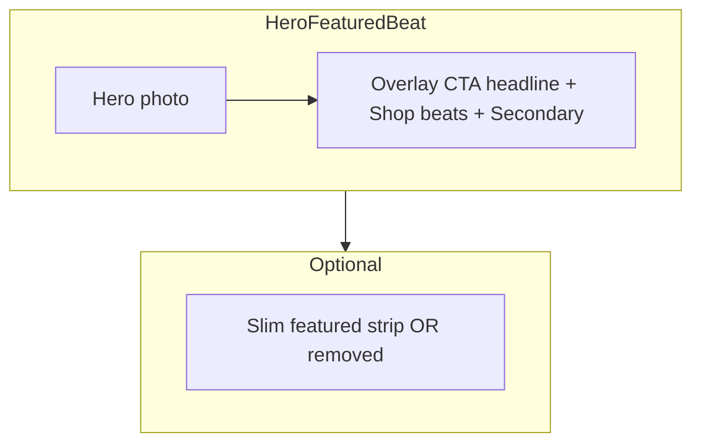

# Site-wide music production imagery + modern hero CTA

## Asset strategy (stock)

- **Source**: Royalty-free stock (Unsplash/Pexels). **Download** optimized **WebP or JPEG** into the repo under [`public/images/`](public/images/) (no hotlinking in production).
- **Attribution**: Code comments next to constants and/or [`lib/images/attributions.ts`](lib/images/attributions.ts) with `{ file, sourceUrl, photographer, photographerUrl }[]`.
- **Naming**:
  - `public/images/site/` — marketing backgrounds (e.g. `studio-console.webp`, `cta-studio.webp`, `sound-story.webp`).
  - `public/images/placements/` — placement card art (`placement-1.webp` …).
  - `public/images/beats/` — covers per slug (`midnight-run.webp`, …) aligned with [`lib/catalog/static-data.ts`](lib/catalog/static-data.ts).

**Search terms**: “music studio dark”, “mixing console low light”, “headphones producer desk”, “abstract album cover dark”, “synthesizer close up” — favor **#050505** + **#00FF88** mood.

## URL helper

- Add [`lib/images/site.ts`](lib/images/site.ts): `siteImageUrl(path)` for local `/images/...` vs absolute URLs. Keep [`getPublicMediaUrl`](lib/storage.ts) for **audio previews** only.

## Data

- Set beat `artwork_path` (or equivalent) in static data to `images/beats/{slug}.webp`.
- Extend `PreviewBeat` + [`mapBeatToPreview`](lib/mappers/beats.ts) with cover URL for catalog thumbnails.

---

## Brand logo (existing asset in `public/`)

**Asset**: Use the logo already in the repo root, e.g. [`public/logo.png`](public/logo.png) (confirm exact filename during implementation — may differ). Reference via **`/logo.png`** with `next/image` (`priority` only in header).

**Today**: [`BrandLogo`](components/layout/brand-logo.tsx) is **text-only** (“HiveMind”); the mark was removed earlier. Re-introduce the **mark + wordmark** pattern for stronger identity.

### Recommended placements (high impact, not redundant)

1. **Site header (primary)** — [`components/layout/brand-logo.tsx`](components/layout/brand-logo.tsx): **`Link` → `Image`** (fixed height ~36–44px, `width`/`height` or aspect box + `object-contain`) + **“HiveMind”** text beside it (existing Space Grotesk). This is the main place users expect a logo.

2. **Footer** — [`components/layout/site-footer.tsx`](components/layout/site-footer.tsx): smaller **logo** above or beside the “HiveMind Productions” line for **brand closure** on long pages (optional `opacity-90` to sit on `#0A0A0A`).

3. **Hero overlay (optional)** — If the header already shows the logo on load, **skip** a second full logo on the hero to avoid duplication. **Instead**, consider a **subtle** treatment only if the hero layout needs balance: e.g. tiny **wordmark-free mark** in the top-left of [`HeroFeaturedBeat`](components/home/hero-featured-beat.tsx) at **low opacity** or only on **xl** breakpoints — **decide at implementation** after header/footer ship.

4. **Final CTA band** — [`components/home/final-cta.tsx`](components/home/final-cta.tsx): optional **small logo** centered **above** “Ready to build?” to anchor the closing CTA (works well with the planned background image).

**Accessibility**: Meaningful **`alt`** on logo images (e.g. “HiveMind Productions”); decorative repeats can use empty alt if linked next to visible text (follow WCAG patterns for logo-in-link).

---

## Hero image / section — modern CTA (new)

**Today**: [`HeroFeaturedBeat`](components/home/hero-featured-beat.tsx) is **image-only**; [`HeroCopyWaveformRow`](components/home/hero-copy-waveform-row.tsx) holds “Featured / Beat / metadata / Play preview / Shop beats” **below** the fold in a separate bordered band — strong separation, less “hero” impact.

**Direction**: Treat the **photo as the hero** again: add a **single, modern CTA cluster** overlaid on the image (bottom-aligned, readable on photo + existing gradients). Keep featured **track context** either (a) in the same overlay as secondary text, or (b) in a slim strip directly under the image — avoid duplicating two competing heroes.

### Recommended layout (2025-style)

1. **Overlay** (inside `HeroFeaturedBeat`, `Container`, `relative z-10`, `flex min-h` + `items-end` or `items-end pb-12`):
   - **Eyebrow**: one line, e.g. `Premium beats · HiveMind` or dynamic featured label (small, `#00FF88`, tracking).
   - **Headline**: short, punchy — e.g. **“Build your next record.”** or **“License-ready beats.”** (not the same as the track title; that stays secondary).
   - **Supporting line** (optional): one sentence max, muted `#A1A1AA`, high contrast on scrim.
   - **Actions** (horizontal, `gap-3`, wrap on mobile):
     - **Primary**: green filled — **“Shop beats”** → `/beats` (main conversion).
     - **Secondary**: outline or glass — **“Play featured”** or **“Preview**” (ties to existing audio/play behavior when wired) or **“Watch videos”** → `/videos`.
   - **Featured track** (tertiary): smaller line under buttons — e.g. `Midnight Run · 140 BPM · Dark trap` with link to `/beats/[slug]` — satisfies “featured beat” without competing with the main headline.

2. **Gradients**: Slightly strengthen **bottom** scrim (`from-[#050505]` via transparent) so white text and green buttons pass contrast on the new stock hero image (tune after asset swap).

3. **[`HeroCopyWaveformRow`](components/home/hero-copy-waveform-row.tsx)**:
   - **Either remove** if all content moves into the hero overlay, **or slim down** to a compact “Now playing / Featured” strip (metadata + chips only) so the page does not repeat the same H1 + buttons twice.
   - Decision during implementation: prefer **one hero CTA** + optional **compact featured strip** below image.

4. **Accessibility**: Overlay headline should be the page **`<h1>`** if it is the primary brand message; featured track title can be `
` or `<h2>` depending on final hierarchy.

### Implementation touchpoints

- [`components/home/hero-featured-beat.tsx`](components/home/hero-featured-beat.tsx) — add overlay markup, props for headline strings (or constants in file), links, optional `featuredSlug` for secondary link.
- [`app/(marketing)/page.tsx`](app/(marketing)/page.tsx) — pass featured beat + strings into hero; adjust `HeroCopyWaveformRow` props or remove.

---

## Other image placements

| Area | Files | Change |
|------|--------|--------|
| Header / footer logo | [`brand-logo.tsx`](components/layout/brand-logo.tsx), [`site-footer.tsx`](components/layout/site-footer.tsx) | See **Brand logo** section |
| Home “The HiveMind sound” | [`app/(marketing)/page.tsx`](app/(marketing)/page.tsx) | `lg:grid` + `next/image` beside copy |
| Placements | [`components/home/placements-grid.tsx`](components/home/placements-grid.tsx) | `Placement.imageSrc` + `Image` in cards |
| Beat detail | [`components/shop/beat-detail.tsx`](components/shop/beat-detail.tsx) | Artwork `Image` from `siteImageUrl` |
| Beats catalog | [`beat-catalog-preview-client.tsx`](components/home/beat-catalog-preview-client.tsx) | Thumbnail column + mobile |
| Final CTA | [`components/home/final-cta.tsx`](components/home/final-cta.tsx) | Background `Image` + overlay |
| Contact | [`app/(marketing)/contact/page.tsx`](app/(marketing)/contact/page.tsx) | Optional `lg:grid` + studio image |

## `next.config`

- Self-hosted `public/` only → no `remotePatterns` unless temporary external URLs.

## Verification

- `npm run build`; check CLS (`sizes`, aspect boxes for `fill`).

